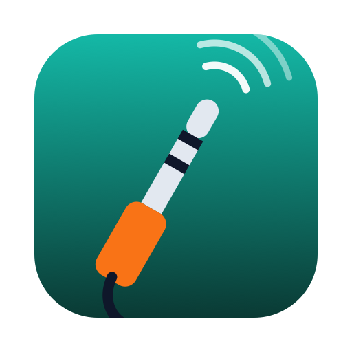

<p align="center">
  
</p>

<h1 align="center">Aux</h1>

<p align="center"><b>Pass the aux — switch your Mac's audio output and input with a keystroke.</b></p>

<p align="center">
  <a href="https://github.com/jimmymarsanico/aux/releases/latest"></a>
  
  <a href="https://github.com/jimmymarsanico/aux/actions/workflows/ci.yml"></a>
  
</p>

Aux is a tiny macOS menu bar app for people who bounce between MacBook speakers, Bluetooth headphones, and wired audio all day. One keystroke cycles your output device; another cycles your microphone. No digging through System Settings mid-meeting.

The menu bar icon always shows **where your audio is going right now** — a speaker for built-in, headphones or AirPods for Bluetooth, a connector for USB, AirPlay when you're casting.

## Features

- 🔁 **Cycle outputs with a global hotkey** — speakers → Bluetooth → headphones → back, from any app
- 🎙 **Cycle inputs too** — a second hotkey switches your microphone the same way
- 🖱 **Or point and click** — the menu lists every output and input; click to switch instantly
- 🌊 **HUD feedback** — a volume-style overlay confirms each switch, then fades away (no notification permissions, no Notification Center clutter)
- 🧭 **Status at a glance** — the menu bar icon mirrors your current output device type
- 🎛 **Choose what cycles** — exclude virtual or rarely-used devices from the rotation in Settings; everything else is included automatically, so new devices just work
- 🔌 **Live device tracking** — plug in headphones or connect Bluetooth and the menu updates immediately
- 🚀 **Launch at login**, no Dock icon, zero third-party dependencies

## Install

1. Download the latest `Aux-x.y.z.dmg` from the [releases page](https://github.com/jimmymarsanico/aux/releases/latest).
2. Open the DMG and drag **Aux** into **Applications**.
3. Launch Aux. Settings opens on first run — record your hotkeys and you're done.

### "Aux can't be opened" on first launch?

Aux is open source and isn't notarized by Apple (that requires a paid developer subscription), so macOS may warn you the first time. Two ways to proceed:

- Open **System Settings → Privacy & Security**, scroll down, and click **Open Anyway**, _or_
- Clear the quarantine flag from Terminal:

  ```sh
  xattr -cr /Applications/Aux.app
  ```

You only need to do this once. If you'd rather not trust a downloaded binary at all, [build it from source](#build-from-source) in about a minute.

## Usage

Click the menu bar icon to see every device:

| Menu | What it does |
|---|---|
| **Output** section | Click any device to make it the system output (sound effects follow along, like System Settings) |
| **Input** section | Click any device to make it the default microphone |
| **Settings…** | Record hotkeys, choose which devices are in each cycle, launch at login |

The checkmark shows the current device; icons show each device's type.

### Hotkeys

Record them in **Settings…** (opens automatically on first launch):

- **Cycle output device** — jumps to the next output in the cycle and shows a HUD with the new device
- **Cycle input device** — same, for microphones

Every device is part of the cycle by default. Use the checkboxes in Settings to drop devices you never switch to (virtual devices, HDMI monitors, and so on).

## How it works

Aux talks to CoreAudio directly: it enumerates devices, sets `kAudioHardwarePropertyDefaultOutputDevice` / `DefaultInputDevice` (plus the sound-effects device, so alerts follow your music), and subscribes to hardware property listeners — which is why the menu never goes stale when you plug things in or AirPods connect on their own. Global hotkeys use Carbon's `RegisterEventHotKey`, which needs no accessibility permissions. No audio is ever captured; Aux only chooses *which* device the system uses.

## Looking for AudioToggle?

Aux 2.0 is a ground-up rewrite of this repo's previous app, AudioToggle. The final v1 build remains installable from the [v1.0.3 release](https://github.com/jimmymarsanico/aux/releases/tag/v1.0.3), and its source lives on the [`legacy` branch](https://github.com/jimmymarsanico/aux/tree/legacy).

## Build from source

Requires macOS 13+ and the Xcode Command Line Tools (`xcode-select --install`).

```sh
git clone https://github.com/jimmymarsanico/aux.git
cd aux
./Scripts/build_app.sh     # → build/Aux.app
./Scripts/package_dmg.sh   # → dist/Aux-x.y.z.dmg (optional)
```

Then move `build/Aux.app` into `/Applications`. The app icon and logo are generated from code, too: `swift Scripts/make_icon.swift`.

## License

[MIT](LICENSE) © Jimmy Marsanico
